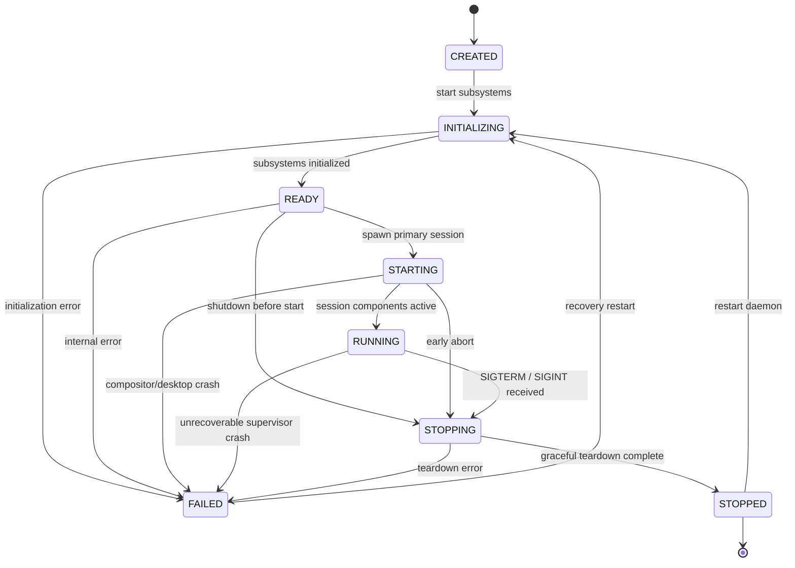

# LDDM Lifecycle Model

## 1. Lifecycle State Machine

LDDM defines an explicit, deterministic state machine governing the entire daemon and session lifecycle.

---

## 2. States

| State | Meaning |
| :--- | :--- |
| `CREATED` | State machine instantiated, no resources allocated. |
| `INITIALIZING` | Loading configuration, initializing signal handlers, setting up runtime directories. |
| `READY` | Core infrastructure ready to spawn graphical sessions. |
| `STARTING` | Orchestrating session components (Weston, LDDE). |
| `RUNNING` | Full desktop stack operational; event loop monitoring signals. |
| `STOPPING` | Controlled teardown: sending SIGTERM to children, closing sockets. |
| `STOPPED` | All child processes reaped, resources freed. Terminal state (or ready for restart). |
| `FAILED` | Critical runtime or initialization failure occurred. |

---

## 3. Transition Rules

- Transitions are strictly validated by `LifecycleStateMachine::is_valid_transition(from, to)`.
- Illegal transitions immediately return an `ErrorCode::InternalInvalidState` error and leave the current state unchanged.
- All valid transitions trigger registered callbacks and emit structured `INFO` log records.
- Thread-safe state query and modification is guaranteed via internal mutex locks.

